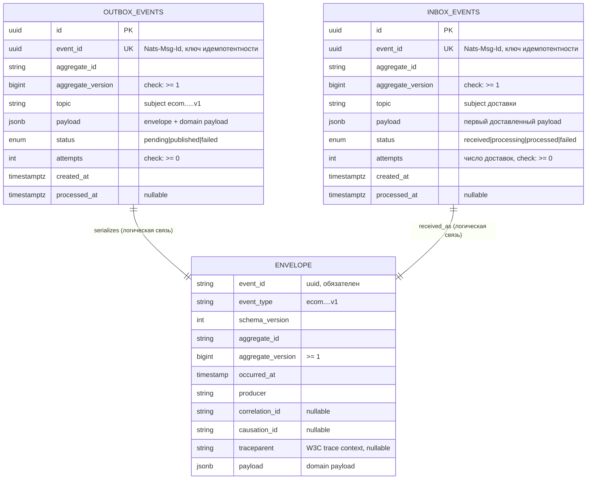

# ERD-OB-001 — Модель outbox/inbox и конверт события

> Описывает модели данных библиотеки `ecom-go-outbox`: таблицы `outbox_events`
> (сторона продюсера, пишется в одной транзакции с бизнес-изменением) и
> `inbox_events` (сторона консьюмера, идемпотентность при дубле `Nats-Msg-Id`).
> Конверт события — эталон платформы `EVENTS-001` v0.2.0 (ecom-schema-registry)
> и feasibility (строки 94–99).
> Mermaid — для человека, ниже — машиночитаемая YAML-таблица для парсера/кодогенерации.

## 1. Диаграмма (для человека)



## 2. Сущности (для парсера)

```yaml
entities:
  - name: OutboxEvent
    table: outbox_events
    description: Событие, записанное в одной транзакции с бизнес-изменением (FR-001, BDD-033#S-1, S-2)
    fields:
      - name: id
        type: uuid
        pk: true
      - name: event_id
        type: uuid
        unique: true
        nullable: false
        description: Nats-Msg-Id при публикации; ключ идемпотентности (FR-002)
      - name: aggregate_id
        type: string(255)
        nullable: false
      - name: aggregate_version
        type: bigint
        nullable: false
        check: "aggregate_version >= 1"
      - name: topic
        type: string(512)
        nullable: false
        description: Subject JetStream по конвенции ecom.<env>.<domain>.<aggregate>.<event>.v1
      - name: payload
        type: jsonb
        nullable: false
        pii: conditional
        description: Полный конверт (envelope) + domain payload
      - name: status
        type: enum
        values: [pending, published, failed]
        default: pending
      - name: attempts
        type: int
        nullable: false
        default: 0
        check: "attempts >= 0"
        description: Число попыток публикации relay-ом; при attempts >= MaxPublishAttempts (дефолт 10) — статус failed, см. INV-9
      - name: created_at
        type: timestamptz
        default: now()
        nullable: false
      - name: processed_at
        type: timestamptz
        nullable: true
        description: Момент успешной публикации (status = published)
    indexes:
      - name: idx_outbox_status
        columns: [status, created_at]
      - name: idx_outbox_topic
        columns: [topic]

  - name: InboxEvent
    table: inbox_events
    description: Запись идемпотентности на стороне консьюмера (FR-002, FR-007, BDD-033#S-3..S-5, S-11)
    fields:
      - name: id
        type: uuid
        pk: true
      - name: event_id
        type: uuid
        unique: true
        nullable: false
        description: Уникальный constraint — защита от дубля Nats-Msg-Id (FR-002, BDD-033#S-3, S-5)
      - name: aggregate_id
        type: string(255)
        nullable: false
      - name: aggregate_version
        type: bigint
        nullable: false
        check: "aggregate_version >= 1"
        description: Монотонная версия агрегата; устаревшее событие не откатывает read model (EVENTS-001, BDD-033#S-4)
      - name: topic
        type: string(512)
        nullable: false
      - name: payload
        type: jsonb
        nullable: false
        pii: conditional
        description: Payload первого доставленного сообщения; повторный дубль с другим payload игнорируется (BDD-033#S-5)
      - name: status
        type: enum
        values: [received, processing, processed, failed]
        default: received
      - name: attempts
        type: int
        nullable: false
        default: 0
        check: "attempts >= 0"
        description: Число доставок JetStream (Nats-Msg-Id + Nats-Deliveries)
      - name: created_at
        type: timestamptz
        default: now()
        nullable: false
      - name: processed_at
        type: timestamptz
        nullable: true
        description: Момент успешной обработки и коммита транзакции
    indexes:
      - name: idx_inbox_aggregate
        columns: [aggregate_id, aggregate_version]

  - name: Envelope
    table: null
    description: Логическая модель конверта события (не таблица) — эталон EVENTS-001 v0.2.0, feasibility «предлагаемый envelope»
    fields:
      - name: event_id
        type: uuid
        nullable: false
        description: Идемпотентность; уникален на продюсера; совпадает с Nats-Msg-Id
      - name: event_type
        type: string(512)
        nullable: false
        description: ecom.<domain>.<aggregate>.<event>.v1
      - name: schema_version
        type: int
        nullable: false
        default: 1
      - name: aggregate_id
        type: string(255)
        nullable: false
      - name: aggregate_version
        type: bigint
        nullable: false
        check: "aggregate_version >= 1"
      - name: occurred_at
        type: timestamp
        nullable: false
      - name: producer
        type: string(255)
        nullable: false
      - name: correlation_id
        type: string(255)
        nullable: true
      - name: causation_id
        type: string(255)
        nullable: true
      - name: traceparent
        type: string(55)
        nullable: true
        description: W3C trace context (w3c.org/TR/trace-context)
      - name: payload
        type: jsonb
        nullable: false
        pii: conditional
```

## 3. Связи (для парсера)

```yaml
relationships:
  - from: OutboxEvent
    to: Envelope
    cardinality: 1:1
    label: serializes
    note: Логическая связь (вложение в payload), не FK: одна строка outbox_events содержит ровно один конверт; event_id таблицы == event_id конверта
  - from: InboxEvent
    to: Envelope
    cardinality: 1:1
    label: received_as
    note: Логическая связь (вложение в payload), не FK: одна строка inbox_events содержит ровно один конверт; event_id таблицы == Nats-Msg-Id доставленного сообщения == event_id конверта
```

## 4. Инварианты и ограничения

- INV-1 (FR-001, BDD-033#S-1, S-2): запись в `outbox_events` выполняется в той же PostgreSQL-транзакции, что и бизнес-изменение; COMMIT → существуют обе записи, ROLLBACK → ни одной. Проверяется библиотекой, тестируется unit-тестом.
- INV-2 (FR-002, BDD-033#S-3, S-5): `inbox_events.event_id` уникален; повторная доставка того же `Nats-Msg-Id` не вызывает обработчик, фиксируется логом «duplicate ignored» с id (NFR-004). Вставка — `INSERT ... ON CONFLICT DO NOTHING` в той же транзакции, что и бизнес-обработка.
- INV-3 (FR-006, BDD-033#S-10): explicit ack в JetStream отправляется ТОЛЬКО после коммита локальной транзакции (commit → ack, см. ADR-001).
- INV-4 (FR-004, BDD-033#S-7..S-9): nack → redelivery с интервалом `AckWait`; `attempts` инкрементируется каждой доставкой; при исчерпании `MaxDeliver` сообщение уходит в dead-letter, а не теряется молча.
- INV-5 (FR-005, BDD-033#S-9, S-12): dead-letter сохраняет исходный payload и метаданные (причина отказа, число попыток); петли «dead-letter → основной поток» нет.
- INV-6 (EVENTS-001, BDD-033#S-4): для одного `aggregate_id` события применяются строго по возрастанию `aggregate_version`; устаревшее/дублирующее событие не откатывает read model.
- INV-7 (FR-007, BDD-033#S-11): сбой между коммитом и ack приводит к redelivery + идемпотентной обработке (INV-2), потерь и дублей нет.
- INV-8 (MIN-4 review-33-artifacts): колонки таблиц (`event_id`, `aggregate_id`, `aggregate_version`, `topic`) ДОЛЖНЫ совпадать с соответствующими полями envelope в `payload`; проверяется библиотекой при записи (INSERT/UPDATE сверяет колонки и конверт), расхождение → ошибка записи.
- INV-9 (MIN-6 review-33-artifacts): политика исчерпания попыток публикации relay: при `outbox_events.attempts >= MaxPublishAttempts` (конфигурируемый порог, дефолт 10) relay прекращает попытки для события, статус → `failed`, событие НЕ удаляется и НЕ теряется (остаётся в таблице для ручного разбора/алерта, NFR-004). Повторный запуск публикации — только после вмешательства оператора (переотправка вручную или сброс статуса), петли авто-ретраев нет.

## 5. Стратегия миграций

- Инструмент: `golang-migrate`
- Шаблон имени: `YYYYMMDDHHMMSS_<entity>_<change>.sql`
- Первые миграции (обратные совместимы, только add): `outbox_events`, `inbox_events` с уникальными constraint-ами.
- Любое разрушающее изменение — две миграции: `add new → backfill → drop old`.
- Поля с секретами/PII в миграциях не создаются (NFR-005).

## 6. PII / Безопасность

| Поле | Класс | Шифрование | Доступ |
|------|-------|------------|--------|
| outbox_events.payload / inbox_events.payload | условная PII (зависит от доменного события) | at-rest: да (TDE БД) | app (relay/consumer), dba |
| Тестовые события и payload (BDD-033) | без PII | — | тесты: политика NFR-005 — события и спеки не содержат PII и секретов |

Политика: библиотека не интерпретирует payload (opaque JSON), не логирует его содержимое;
все идентификаторы в логах — только `event_id`. Продюсер домена отвечает за минимизацию PII
в доменном payload.

## 7. Трассируемость FR ↔ BDD ↔ сущности

| FR | BDD-033 | Сущности / механизм |
|----|---------|---------------------|
| FR-001 | S-1, S-2 | outbox_events (запись в общей транзакции) |
| FR-002 | S-3, S-4, S-5 | inbox_events (unique event_id, ON CONFLICT DO NOTHING, лог «duplicate ignored») |
| FR-003 | S-6 | topic/конверт (subject-конвенция, Nats-Msg-Id = event_id) |
| FR-004 | S-7, S-8, S-9 | attempts, JetStream AckWait/MaxDeliver, redelivery |
| FR-005 | S-9, S-12 | dead-letter (payload + метаданные), отсутствие петли |
| FR-006 | S-10 | порядок commit → ack (ADR-001) |
| FR-007 | S-11 | inbox_events (INV-2) + redelivery после рестарта |

## 8. Открытые вопросы

**Решённые:**
- [x] Q-1 (PRD-033 Q-1): формат `Nats-Msg-Id` — **UUID `event_id`** (канонический ключ идемпотентности, INV-2). Решение ERD-OB-001, 2026-08-01, согласовано @tech-lead (review-33-artifacts, MAJ-3; PRD-033 §13).

**Открытые:**
- [ ] Q-2 (BDD-033 Q-1): использовать ли native JetStream dedup (`Nats-Msg-Id`) в дополнение к inbox-таблице? @tech-lead, до старта unit-тестов outbox (влияет на трактовку FR-002/S-3).
- [ ] Q-3 (BDD-033 Q-2): формат метаданных dead-letter — envelope-поля или отдельные headers? @tech-lead, до GA (влияет на INV-5/FR-005).
- [ ] Q-4 (PRD-033 Q-2): fault injection — в production-код relay или test-only билд? @tech-lead, до старта интеграционных тестов (влияет на тесты FR-007).
